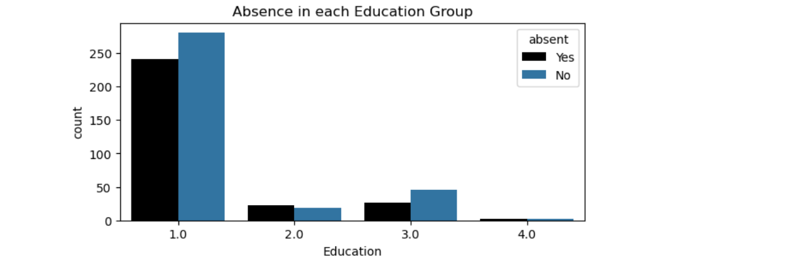
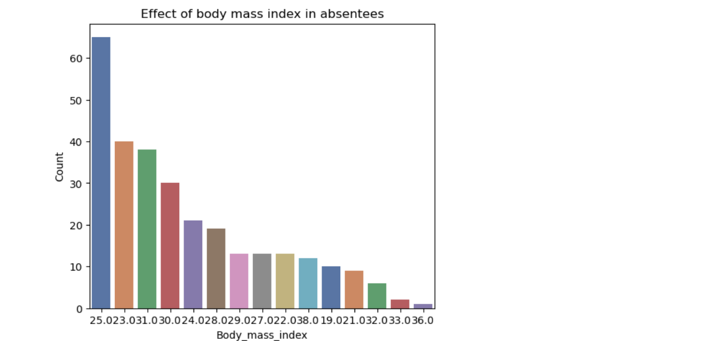
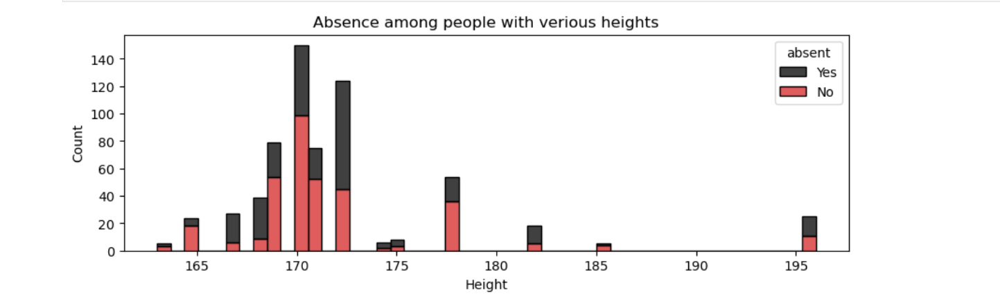
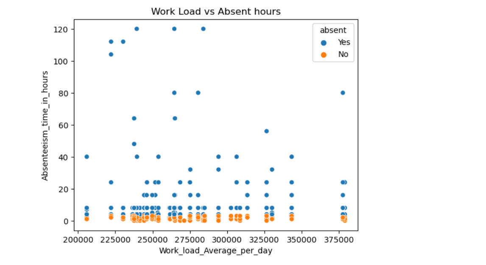
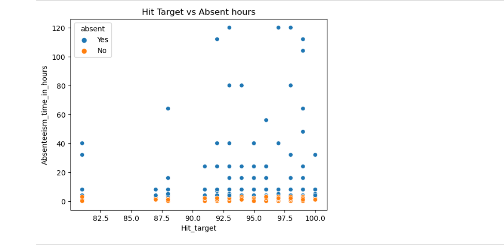

# BerkeleyMLCapstoneEDA
<br>
<br>

### Business case
In todays environment of workplace is extremely competitive and leads to increased stress and health issues. This project analyse relationships of workplace absenteeism and various factors. In this project absenteeism is defined as absence from work at normal hours.
#### Dataset
I have used a data set from Kaggle “Absenteeism_at_work_Project.xls”. 

```
The dataset have following fields:
ID                                   int64
Reason_for_absence                 float64
Month_of_absence                   float64
Day_of_the_week                      int64
Seasons                              int64
Transportation_expense             float64
Distance_from_Residence_to_Work    float64
Service_time                       float64
Age                                float64
Work_load_Average_per_day          float64
Hit_target                         float64
Disciplinary_failure               float64
Education                          float64
Children                           float64
Social_drinker                     float64
Social_smoker                      float64
Pet                                float64
Weight                             float64
Height                             float64
Body_mass_index                    float64
Absenteeism_time_in_hours          float64
```

## Feature Analysis
Lets analyse each feature to find out their relation with the absenteeism.
#### Feature : Absenteeism_time_in_hours
This feature represents number of hours employee has taken off during the work day.
The histogram below shows how many hours people take absence. 
<br>
<br>
75% of them taken 8 hours. Median is 3 hours. Lets use absent or not as target feature. For this we can define hours taken above median as absent. Otherwise not absent.

<br>
#### Feature : ID
In the bar chartbelow, we are looking at the counts of all employees absences. We can see that the employee with ID 3, 11 and 20 have the most absences, with an absence count arround 30 times. We also see that the employee with ID 32 has the least amount of absences, with an absence count close to 0. Most of the employees have taken absennce 5 to 15 times.

The feature ID do not have a effect in emlpoyee absence. So ID needs to be removed from training.
<br>

<br>
#### Feature :  Month_of_absence
In the bar chart below, we see that most employees are absent from work during the month of July with more than 50 recorded absences. The least amount of absences occur in January with less than 15 absences. Months May, June, August, October and November has almost same number of absences of 25 times. There seems to be no significance in the distribution of absences across the months.
<br>
<br>

<br>

#### Feature : Seasons
The 4 seasons are 1-Spring, 2-Summer, 3-Fall, 4-Winter. Most people were absent in fall and spring. In fall, there are eqaual number of people not absent as well. Lowest absence is in summer.
<br>
<br>

<br>

<br>

#### Feature : Day_of_the_week
The day of weeks are 1-Sunday, 2-Monday, 3-Tuesday, 4-Wednesday, 5-Thursday, 6-Friday, 7-Saturday. Most number of absence is noted on Monday and least on Thursday. There seems to have a relation with day of week on absence.
<br>
<br>

<br>

<br>

#### Feature : Age
The absence happened in all age groups. Within absent people, age 30 and 28 have highest absence. The younger age group were more absent than old age group
<br>

<br>

<br>

#### Feature : Social_drinker
In the bar chart, groups are 0.0-Not Social Drinker, 1.0-Social Driker. There is more absense in Social Drinking group. Social drinking has some effect on being absent
<br>


<br>
<br>

#### Feature : Social_smoker
In the bar chart the groups are 0.0-Not a Social Smoker, 1.0-Social Smoker. The absence is more among non-smocking group, which make sence as there is less smoking people at workplace.
<br>

<br>
<br>

#### Feature : Education
The education groups are 1 High school, 2 Graduate, 3 Postgraduate, 4 Masters. Highest absence can be seen in group with highschool education. Lowest absence found in people with Masters degree. Educated people seems to be less absent at workplace.
<br>

<br>
<br>

<br>
<br>

#### Feature : Children
Within absentees, no children group have highest absence. People with more children seems to be less absent at workplace.
<br>

<br>


<br>
<br>

#### Feature : Pet
Within absentees, no pets group have highest absence. People with more pets seems to be less absent at workplace.
<br>

<br>

<br>
<br>

#### Feature : Body_mass_index
Wihin absentees, people with body mass index 25 being more absent. The absenteeism is visible in all body mass indices.
<br>

<br>

<br>

<br>
<br>

#### Feature : Weight
People with weights 70 and 90kg were more absent than others. Being absent or not seems to be equaly distributed in all weight groups
<br>

<br>
<br>

#### Feature : Height
Within absentees, people having height 172 cm being more absent. Being absent or not is equally distributed in all heights. The height of a person should not affect being absent and this column needs to be dropped.
<br>

<br>

<br>
<br>

#### Feature : Distance_from_Residence_to_Work
The distance work has less relationship with absenteeism. People are absent regardless of distance from work.
<br>

<br>

<br>
<br>

#### Feature : Transportation_expense
Transportation expense seems to have less effect on being absent. But this feature is an importatnt factor compared to others.
<br>

<br>

<br>
<br>

#### Feature : Work_load_Average_per_day
The workload is equaly distributed among absentees and non absentees.
<br>

<br>

<br>
<br>

#### Feature : Hit_target
The hit target has no perticular relationship with absence. So this feature needs to be dropped.
<br>

<br>

<br>
<br>

#### Feature : Reason for absence
The "Reason for absence" is International Code of Diseases (ICD). The codes are:
```
•	0: 'Unknown',
•	1: 'Certain infectious and parasitic diseases',
•	2: 'Neoplasms',
•	3: 'Diseases of the blood and blood-forming organs and certain disorders involving the immune mechanism',
•	4: 'Endocrine, nutritional and metabolic diseases',
•	5: 'Mental and behavioural disorders',
•	6: 'Diseases of the nervous system',
•	7: 'Diseases of the eye and adnexa',
•	8: 'Diseases of the ear and mastoid process',
•	9: 'Diseases of the circulatory system',
•	10: 'Diseases of the respiratory system',
•	11: 'Diseases of the digestive system',
•	12: 'Diseases of the skin and subcutaneous tissue',
•	13: 'Diseases of the musculoskeletal system and connective tissue',
•	14: 'Diseases of the genitourinary system',
•	15: 'Pregnancy, childbirth and the puerperium',
•	16: 'Certain conditions originating in the perinatal period',
•	17: 'Congenital malformations, deformations and chromosomal abnormalities',
•	18: 'Symptoms, signs and abnormal clinical and laboratory findings, not elsewhere classified',
•	19: 'Injury, poisoning and certain other consequences of external causes',
•	20: 'External causes of morbidity and mortality',
•	21: 'Factors influencing health status and contact with health services',
•	22: 'Patient follow-up',
•	23: 'Medical consultation',
•	24: 'Blood donation',
•	25: 'Laboratory examination',
•	26: 'Unjustified absence',
•	27: 'Physiotherapy',
•	28: 'Dental consultation'
```
<br>

The medical codes are grouped into 4 following:

```
1 Health_Services_and_Patient_Management
2 Infectious_and_Chronic_Diseases
3 Sensory_and_External_Diseases
4 Reproductive_and_Developmental_Health
```

<br>

<br>
<br>

#### Correlation matrix
The heat map shows following relationships among features. First let us analyse relationship with target feature 'absent'. The 'absent' have positive effect with 'Transportation Expense', number of children, medical reason 'Infectious_and_Chronic_Diseases' and Sensory_and_External_Diseases. The 'absent' have negative effect with medical reason 'Health_Services_and_Patient_Management'. The correlation matrix also shows body related relationships between weight and age, weight and body mass index, weight and height, body mass index and age. The month of absence and seasons have a relationship.

Overall, heat map does not show any strong relation for being absent.
<br>


### Feature Engineering
Based on the above data analysis I ahve decided to drop the features ID, Height, Hit_target, Disciplinary_failure and Service_time, as they do not provide meaningfull contribution for training and some cases features like Height can be misleading. The feature 'Absenteeism_time_in_hours' is converted into  binary column 'Absent'
One Hot encoding was applied to Education and Reason_for_absence

### Modeling
Initial modeling was performed using Logistic Regression. This provided an accurracy of 0.7271. Below table gives analysis of coefficients with odds ratio.


